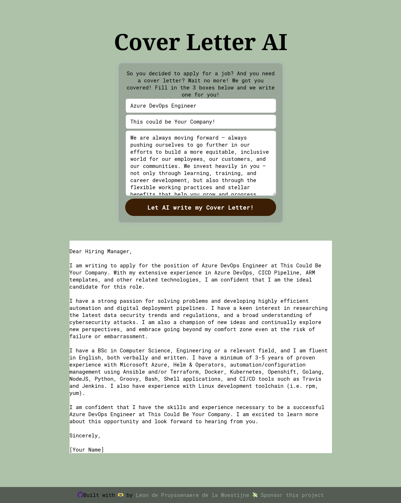

# GPT Cover Letter

## Introduction

This application uses OpenAI GPT to write a cover letter for you. Fill in the position, company and the job description you are applying for and it generates a cover letter.

## Usage

You can try out the demo for free and as long as my OpenAi credits lasts!




Or try the [demo](https://cover-letter.wieisleon.nl)


## Development


### Requirements

You need to have an account at OpenAi. This can be a free account. 

Get your API Key [here](https://platform.openai.com/account/api-keys)


Configure API key in `.env.local` (see `.example.env.local`):

```
GPT_API_KEY=open-ai-api-GPT_API_KEY
```

For logging I use Azure Tables with SAS authorization. You can skip this step if you don't want to have logging. It will log to a file as well.

### To run the app

1. Clone the repo

```sh
git clone git@github.com:leonpw/gpt-cover-letter.git
```

2. Install the dependencies

```sh
npm install

# or yarn, pnpm, etc...
```

3. Run the app

```sh
npm run dev
```

4. Now open http://localhost:3000 to view and use the app


## Credits

This application is inspired by [RoamAround.io](https://www.roamaround.io/) of [Nader](https://nader.arweave.dev/)!